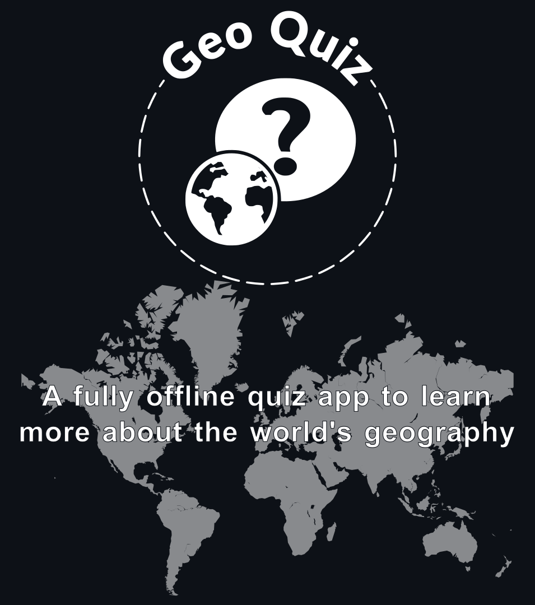
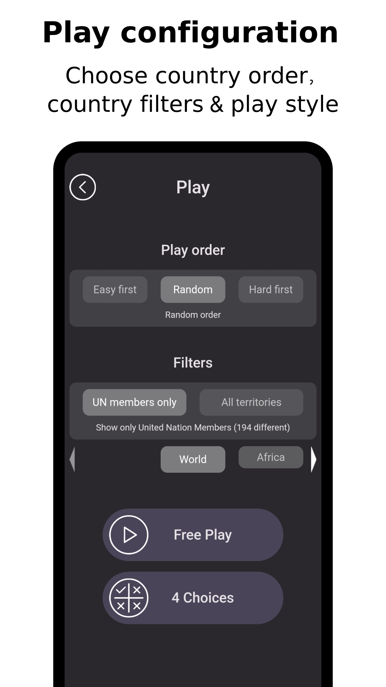
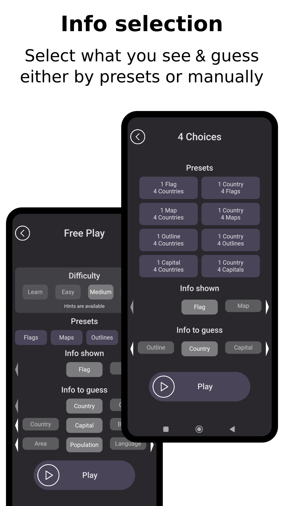
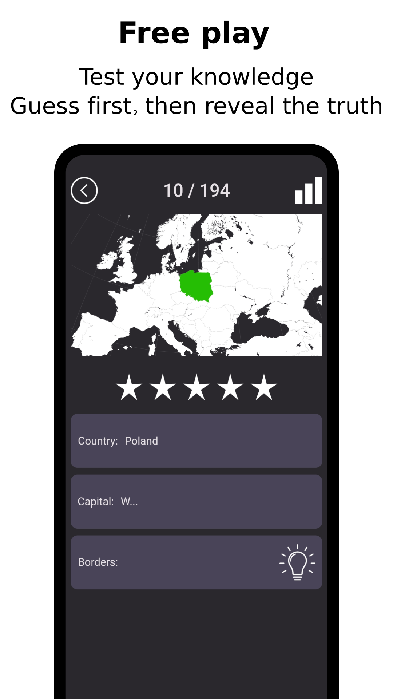
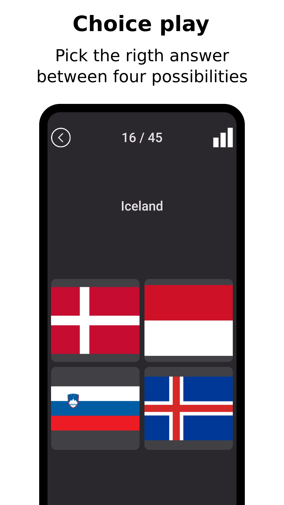
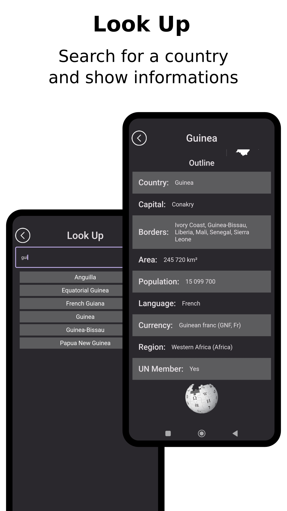
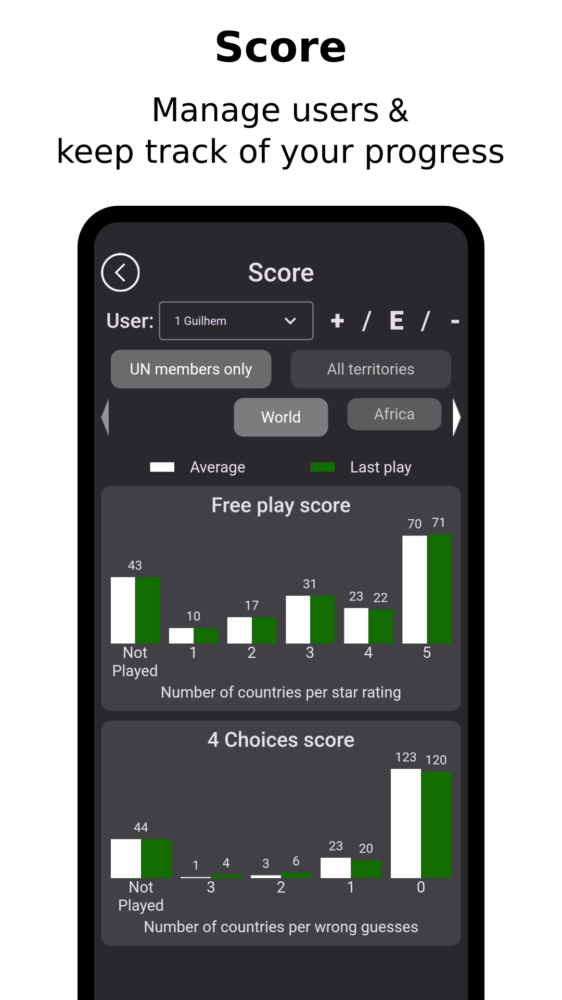

App still under dev - no official version 

# Screenshots 

|              |    |
:---------------------:|:-------------------:
  |  
  |  
  |  


# Sources

|type| source | last update| Place to put sources|
|- | - | - | - |
| Geo json files | combined [mledoze github](https://github.com/mledoze/countries) and [Natural Earth](https://www.naturalearthdata.com/downloads/10m-cultural-vectors/) data via [datahub](https://datahub.io/core/geo-countries)  |  28/04/2025 |  [sources/flags](sources/flags) folder & [sources/countries.geojson](sources/countries.geojson)
| Population & Area | [United Nations](https://population.un.org/wpp/) via  [World Population Review](https://worldpopulationreview.com/)| 01/05/2025 | [sources/world_pop.csv](sources/worl_pop.csv) |
| Everything else | [mledoze github](https://github.com/mledoze/countries) | 10/03/2025 | [sources/countries.json](sources/countries.json) & [sources/flags](sources/flags) folder|


# Contact

Guilhem Mathieux [@guimath](https://github.com/guimath)
- dedicated mail: [guilhem.geoquiz@gmail.com](mailto:guilhem.geoquiz@gmail.com)


# Technical aspects

## Data Transformation

This app is made using rust. We used the slint framework for the front end.

Data from the different sources are processed in 2 steps:
1. Map generation
1. Aggregation


###  Maps generation 

Maps where generated using [matplotlib Basemap](https://matplotlib.org/basemap/stable/). Python scripts for the generation can be found in [maps.py](sources/maps.py) and [outlines.py](sources/outlines.py)

| Type | Projection | Generation date | 
| - | - | - | 
| Maps | [Azimuthal equidistant](https://en.wikipedia.org/wiki/Azimuthal_equidistant_projection) | 28/04/2025 | 
| Outlines | [Mercator](https://en.wikipedia.org/wiki/Mercator_projection) (except Antartica, Fiji, Kiribati & Russia in [Azimuthal equidistant](https://en.wikipedia.org/wiki/Azimuthal_equidistant_projection))  | 28/04/2025 | 

### Aggregation

Aggregation is done by the [prepare.rs]() file. It parses the different source files to produce a single Json that will be included in the compiled code.
It also includes the maps & outline as paths (not embedded images)
```sh
cargo run --example prepare
```

## Building

Once the map generation and data aggregation steps are done, you can build and run

### Running on desktop

Can run on desktop with `cargo run`

### Running on android

1. Install android studio and set ANDROID_NDK_ROOT & ANDROID_HOME (should be done in env.sh but you might need to change the path based on your installation)
2. Activate developer mode on an android phone (usually in settings tap Build Number many times)
3. Enable debugging on the device (usually settings > Developer options > USB debugging. You will need an additional confirmation when you run debugging from a desktop the first time)
4. Connect via USB and run `x devices` to get adb handle of your device
5. Update env.sh with your setup (adb handle & android environment variables)
6. Install & run with `./make_geo.sh run_android`
7. Copy the entire data directory to your device (Android/data/com.example.geo_quiz/files)
